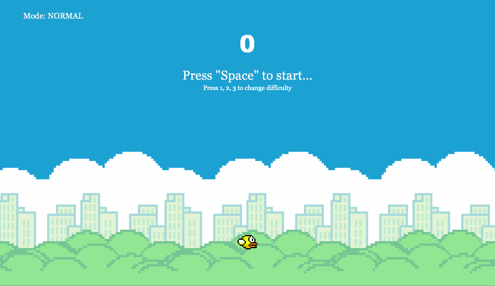

## Overview

This is a recreation of flappy bird, a famous mobile game, where player controls a bird, attempting to fly between 
columns of green pipes without hitting them. By pressing space bar, the bird will fly up a small distance, or the bird 
will keep falling if nothing is pressed. If the bird hits the obstacles or the ground, the game will end. The goal of 
the game is to stay alive as long as possible, with the score updating automatically each time the bird passes a pipe.

## Set Up

* You need to have Cinder library installed on your machine
* Making sure Cinder runs properly on your choice of IDE
* Download this project as a ZIP file and open it inside cinder folder
* Run the program by selecting flappybird-simulation

## Controls

* Press **Space Bar** to start the game/ make the bird fly
* Press **Return** to play a new instance
* Press **1, 2, 3** to select different difficulties 

## Demonstration

Change difficulty

Game instance

